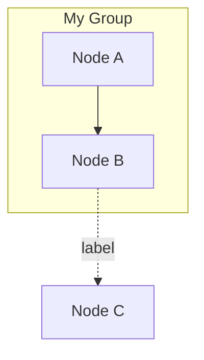
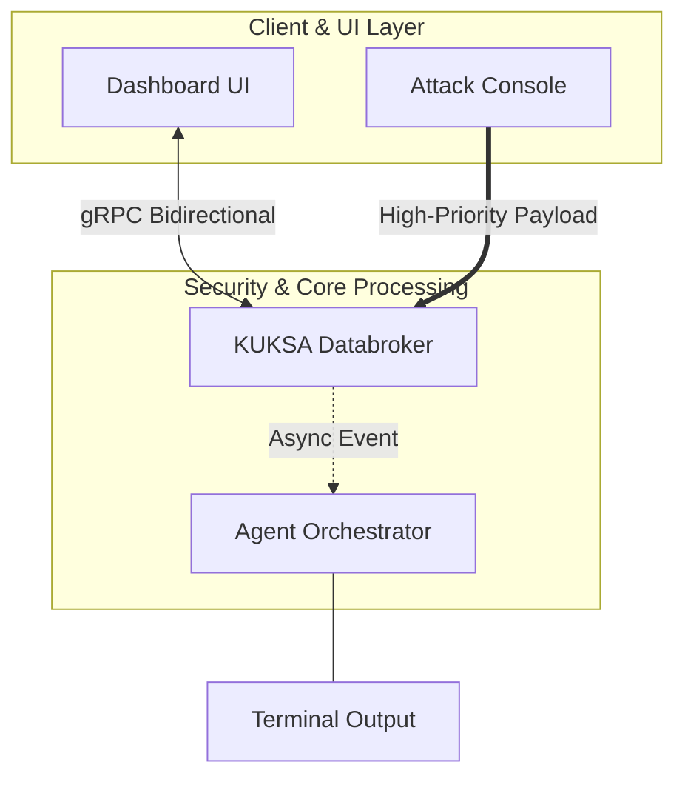

# ⚡ Ultimate Mermaid Architect & Designer

A Streamlit-based visual editor and live designer for [Mermaid](https://mermaid.js.org/) flowchart diagrams — featuring real-time styling controls, a drag-and-drop interactive canvas powered by [Cytoscape.js](https://js.cytoscape.org/), and one-click export to both Mermaid markup and PNG.

---

## ✨ Features

| Feature | Description |
|---|---|
| **Live Mermaid Renderer** | Instantly renders your diagram via the official Mermaid v10 ESM build from CDN |
| **Interactive Canvas** | Drag, reposition, and explore your diagram nodes via a full Cytoscape.js graph workbench |
| **Shape Rewriter** | Automatically rewrites your Mermaid source to apply the selected node shape (rounded box, oval, diamond, hexagon) |
| **Full Color Palette** | Per-component color pickers for node fill, border, text, subgraph background and border |
| **Typography Controls** | Choose font family and independently set node and subgraph label font sizes |
| **Subgraph Support** | Nested subgraphs are parsed, rendered, and visually grouped on the interactive canvas |
| **Export — Mermaid** | Generate clean, styled Mermaid markup from the current canvas layout |
| **Export — PNG** | Download a high-resolution (2× scale) PNG snapshot of the interactive canvas |
| **Compiled Code View** | Inspect the full styled Mermaid source (including `%%init` theme directives and `classDef`) at the bottom of the page |
| **Live Render Token** | A sidebar indicator that changes on every style update — visual proof that the diagram re-renders reactively |

---

## 🖼️ Screenshot

> Tip: run the app and press `S` to take a Streamlit screenshot, or use the PNG export button on the canvas.

```
┌─────────────────────────────────────────────────────────────┐
│  Sidebar: Shape / Padding / Font / Colors                   │
├──────────────────────────┬──────────────────────────────────┤
│  📝 Mermaid Source        │  🧜 Mermaid Render               │
│  Editor (text area)      │  🎨 Interactive Canvas           │
│                          │                                  │
│                          │  [Export Mermaid] [Export PNG]   │
├──────────────────────────┴──────────────────────────────────┤
│  💾 Visual Theme Code Base (compiled Mermaid source)         │
└─────────────────────────────────────────────────────────────┘
```

---

## 🚀 Quick Start

### Prerequisites

- Python 3.9 or higher
- `pip`

### Installation

```bash
# 1. Clone the repository
git clone https://github.com/peterbusch42/mermaidEd.git
cd mermaidEd

# 2. (Recommended) Create and activate a virtual environment
python -m venv .venv
source .venv/bin/activate        # macOS / Linux
# .venv\Scripts\activate         # Windows

# 3. Install dependencies
pip install -r requirements.txt

# 4. Run the app
streamlit run app.py
```

The app opens automatically in your default browser at `http://localhost:8501`.

---

## 🗂️ Project Structure

```
mermaidEd/
├── app.py              # Main Streamlit application
├── requirements.txt    # Python dependencies
└── README.md           # This file
```

---

## 🎛️ How to Use

### 1 — Write or Paste Mermaid Code

The **Mermaid Source Editor** text area (center of the page) accepts any valid Mermaid `flowchart TD` / `flowchart LR` diagram.



Supported syntax elements:

| Element | Mermaid syntax |
|---|---|
| Default rectangle node | `id["Label"]` |
| Rounded node | `id("Label")` |
| Stadium / pill node | `id(["Label"])` |
| Diamond / decision | `id{"Label"}` |
| Hexagon | `id{{"Label"}}` |
| Subgraph | `subgraph id ["Label"] … end` |
| Solid arrow | `A --> B` or `A -->|label| B` |
| Thick arrow | `A ==> B` |
| Dashed arrow | `A -.-> B` |
| Bidirectional | `A <--> B` |
| No arrow (link) | `A --- B` |

---

### 2 — Adjust Styles in the Sidebar

All controls live in the left sidebar under **🎨 Canvas & Node Stylist**.

#### Node Shape & Geometry

| Control | Effect |
|---|---|
| **Default Node Shape** | Rewrites `["Label"]` nodes in the Mermaid source to the selected shape (`roundrectangle`, `ellipse`, `diamond`, `hexagon`). Subgraph declarations, style lines, and `classDef` lines are never touched. |
| **Node Padding / Spacing (px)** | Controls the inner padding of nodes on the interactive canvas (10–50 px). |

#### Typography

| Control | Effect |
|---|---|
| **Font Family** | Applies the chosen font (`sans-serif`, `monospace`, `serif`, `cursive`) to nodes, subgraph labels, and edge labels. |
| **Node Font Size (px)** | Font size for node labels (10–24 px). |
| **Subgraph Font Size (px)** | Font size for subgraph / cluster headings (12–32 px). |

#### Color Customizer

| Control | Effect |
|---|---|
| **Node Fill Color** | Background color inside every regular node. |
| **Node Border Color** | Stroke color of node borders and edge lines/arrows. |
| **Node Text Color** | Text color inside nodes and on edge labels. |
| **Border Width (px)** | Stroke width of node borders (1–5 px). |
| **Subgraph Fill Color** | Background fill of subgraph / cluster regions. Also used as the canvas and diagram background. |
| **Subgraph Border Color** | Stroke color of subgraph outlines. |

---

### 3 — Mermaid Render Tab

The **🧜 Mermaid Render** tab shows the live-rendered diagram using the official Mermaid JS library.

- Styles are applied via an `%%init` theme block (overrides Mermaid's built-in variables) plus a `classDef customStyle` rule, with CSS post-render overrides to guarantee font and stroke sizes are respected.
- Every sidebar change triggers a full re-render thanks to Streamlit's reactive execution model.

---

### 4 — Interactive Canvas Tab

The **🎨 Interactive Canvas** tab embeds a [Cytoscape.js](https://js.cytoscape.org/) graph that mirrors your Mermaid diagram.

**What you can do on the canvas:**

- **Drag nodes** — freely reposition any node or subgraph container.
- **Pan** — click and drag the background to pan around the canvas.
- **Zoom** — use the mouse wheel or trackpad to zoom in and out.
- **Export as Mermaid** — click the button to generate clean Mermaid markup from the current canvas layout. The output appears in a scrollable text area below the canvas.
- **Export as PNG** — downloads a full-resolution (2× scale) PNG of the entire canvas graph, including nodes that may be outside the visible viewport.

**Layout algorithm:** [CoSE (Compound Spring Embedder)](https://js.cytoscape.org/#layouts/cose) — a force-directed layout that respects compound/parent–child (subgraph) nesting, with a node repulsion of 8000 and ideal edge length of 110 px.

---

### 5 — Compiled Code View

At the bottom of the page, the **💾 Visual Theme Code Base** section displays the full compiled Mermaid source that is sent to the renderer. You can copy this code and use it in any tool that supports Mermaid (GitHub Markdown, Notion, Confluence, VS Code Mermaid preview extensions, etc.).

---

## 🔧 Technical Details

### Python Back-End (`app.py`)

| Component | Description |
|---|---|
| `apply_shape_to_mermaid()` | Line-aware Mermaid source transformer. Uses regex to rewrite `["Label"]` node syntax to the selected shape while skipping subgraph, style, classDef, and comment lines. |
| `parse_mermaid()` | State-machine parser that extracts nodes (with parent/subgraph membership), edges (with label and arrow type), and subgraph definitions from raw Mermaid text. Used to build the Cytoscape element list. |
| `compiled_code` | Assembled from an `%%init` themeVariables block + the shape-rewritten Mermaid source + a `classDef customStyle` rule. |

### Front-End Dependencies (CDN — no local install required)

| Library | Version | Purpose |
|---|---|---|
| [Mermaid](https://mermaid.js.org/) | 10.x (ESM) | Renders the Mermaid diagram in Tab 1 |
| [Cytoscape.js](https://js.cytoscape.org/) | 3.26.0 | Interactive drag-and-drop graph canvas in Tab 2 |

### Python Dependencies

| Package | Purpose |
|---|---|
| `streamlit` | Web app framework; drives the UI, sidebar widgets, and the reactive execution loop |
| `re` | (stdlib) Regex-based Mermaid parser and shape rewriter |
| `json` | (stdlib) Serialises the parsed element list into JSON for Cytoscape |
| `hashlib` | (stdlib) Generates a cache-buster token to force the Mermaid iframe to re-render on every style change |

---

## 📋 Default Example Diagram

The editor pre-loads with a sample system architecture diagram:



---

## 💡 Tips & Tricks

- **Live reload:** Streamlit re-executes the entire script on every sidebar interaction — just change a color or slider and the diagram updates instantly.
- **Multiple diagrams:** Paste any Mermaid flowchart into the editor; the parser and canvas adapt automatically.
- **Exporting for documentation:** Use the compiled code from the bottom section directly in GitHub README files, Notion pages, or Mermaid Live Editor.
- **Large graphs:** Increase Node Padding and adjust the font size down to keep node labels readable on dense diagrams.
- **Subgraph grouping:** On the canvas, subgraphs appear as compound parent nodes — drag the subgraph container to move all children together.

---

## 🤝 Contributing

Pull requests are welcome! For major changes, please open an issue first to discuss what you would like to change.

1. Fork the repository
2. Create your feature branch: `git checkout -b feature/my-feature`
3. Commit your changes: `git commit -m 'Add my feature'`
4. Push to the branch: `git push origin feature/my-feature`
5. Open a Pull Request

---

## 📄 License

[MIT](https://choosealicense.com/licenses/mit/)

---

*Built with [Streamlit](https://streamlit.io/) · Rendered by [Mermaid](https://mermaid.js.org/) · Interactivity by [Cytoscape.js](https://js.cytoscape.org/)*
