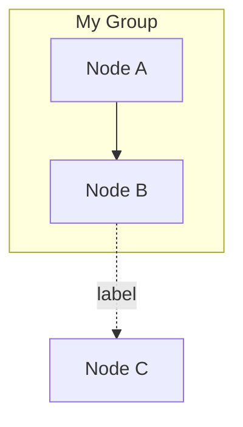
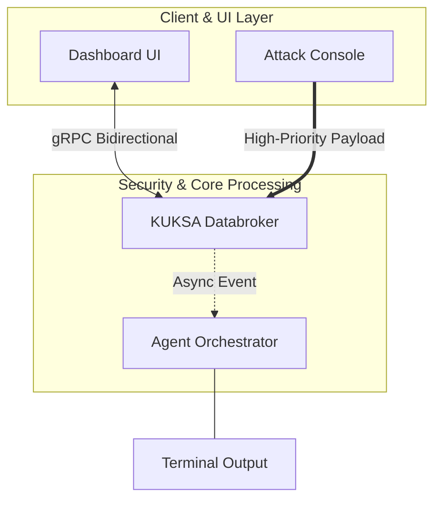

# 🗂️ GalleryEd

A Streamlit app for viewing and editing diagrams and documents. The **Gallery** previews every Mermaid, draw.io and Markdown file in a folder at a glance and opens it with a double-click — diagrams in the draw.io desktop app, Markdown documents as Word files via pandoc. The **Mermaid Designer** is a visual editor for [Mermaid](https://mermaid.js.org/) flowcharts with real-time styling controls, a drag-and-drop interactive canvas powered by [Cytoscape.js](https://js.cytoscape.org/), and one-click export to both Mermaid markup and PNG.

---

## ✨ Features

| Feature | Description |
|---|---|
| **Live Mermaid Renderer** | Instantly renders your diagram via the official Mermaid v10 ESM build from CDN |
| **Interactive Canvas** | Drag, reposition, and explore your diagram nodes via a full Cytoscape.js graph workbench |
| **Shape Rewriter** | Automatically rewrites your Mermaid source to apply the selected node shape (rounded box, oval, diamond, hexagon) |
| **Full Color Palette** | Per-component color pickers for node fill, border, text, subgraph background and border |
| **Typography Controls** | Choose font family and independently set node and subgraph label font sizes |
| **Subgraph Support** | Nested subgraphs are parsed, rendered, and visually grouped on the interactive canvas |
| **Export — Mermaid** | Generate clean, styled Mermaid markup from the current canvas layout |
| **Export — PNG** | Download a high-resolution (2× scale) PNG snapshot of the interactive canvas |
| **Compiled Code View** | Inspect the full styled Mermaid source (including `%%init` theme directives and `classDef`) at the bottom of the page |
| **Live Render Token** | A sidebar indicator that changes on every style update — visual proof that the diagram re-renders reactively |
| **Gallery** | Scan a whole folder (optionally with subfolders) for Mermaid, draw.io and Markdown files and browse small-scale previews of all of them on one page |
| **draw.io Support** | Reads `.drawio` / `.dio` files (plain or compressed, multi-page) and `.drawio.svg` / `.drawio.png` exports with embedded diagrams |
| **Content Search** | Filter the gallery by file name, folder, page name or any text inside the diagrams |
| **Double-Click to Open** | Every diagram opens in the installed draw.io desktop app — Mermaid is converted into editable draw.io shapes |
| **Markdown → Word** | Markdown files get a page preview card; double-click converts them with pandoc and opens the `.docx` in Word |

---

## 🖼️ Screenshot

> Tip: run the app and press `S` to take a Streamlit screenshot, or use the PNG export button on the canvas.

```
┌─────────────────────────────────────────────────────────────┐
│  Sidebar: Shape / Padding / Font / Colors                   │
├──────────────────────────┬──────────────────────────────────┤
│  📝 Mermaid Source       │  🧜 Mermaid Render               │
│  Editor (text area)      │  🎨 Interactive Canvas           │
│                          │                                  │
│                          │  [Export Mermaid] [Export PNG]   │
├──────────────────────────┴──────────────────────────────────┤
│  💾 Visual Theme Code Base (compiled Mermaid source)        │
└─────────────────────────────────────────────────────────────┘
```

---

## 🚀 Quick Start

### Prerequisites

- Python 3.9 or higher
- `pip`
- Optional, for the Gallery: the [draw.io desktop app](https://www.drawio.com/) and [pandoc](https://pandoc.org/installing.html) (`brew install pandoc`)

### Installation

```bash
# 1. Clone the repository
git clone https://github.com/peterbusch42/mermaidEd.git
cd mermaidEd

# 2. (Recommended) Create and activate a virtual environment
python -m venv .venv
source .venv/bin/activate        # macOS / Linux
# .venv\Scripts\activate         # Windows

# 3. Install dependencies
pip install -r requirements.txt

# 4. Run the app
streamlit run app.py
```

The app opens automatically in your default browser at `http://localhost:8501`.

---

## 🗂️ Project Structure

```
mermaidEd/
├── app.py              # Entry point — page navigation
├── designer.py         # Page 1: Mermaid Designer (editor, renderer, canvas)
├── gallery.py          # Page 2: Gallery (folder scan, double-click handling)
├── gallery_view.js     # Gallery browser component: thumbnails, filter, double-click
├── gallery_view.css    # Gallery component styles
├── diagram_scan.py     # Finds and parses Mermaid / draw.io / Markdown files (no Streamlit dependency)
├── requirements.txt    # Python dependencies
└── README.md           # This file
```

---

## 🎛️ How to Use

The app has two pages, listed in the sidebar: **⚡ Mermaid Designer** (sections 1–5) and **🗂️ Gallery** (section 6).

### 1 — Write or Paste Mermaid Code

The **Mermaid Source Editor** text area (center of the page) accepts any valid Mermaid `flowchart TD` / `flowchart LR` diagram.


```mermaid
flowchart TD
    subgraph myGroup ["My Group"]
        A["Node A"]
        B["Node B"]
    end
    A --> B
    B -.->|label| C["Node C"]
```

Supported syntax elements:

| Element | Mermaid syntax |
|---|---|
| Default rectangle node | `id["Label"]` |
| Rounded node | `id("Label")` |
| Stadium / pill node | `id(["Label"])` |
| Diamond / decision | `id{"Label"}` |
| Hexagon | `id{{"Label"}}` |
| Subgraph | `subgraph id ["Label"] … end` |
| Solid arrow | `A --> B` or `A -->|label| B` |
| Thick arrow | `A ==> B` |
| Dashed arrow | `A -.-> B` |
| Bidirectional | `A <--> B` |
| No arrow (link) | `A --- B` |

---

### 2 — Adjust Styles in the Sidebar

All controls live in the left sidebar under **🎨 Canvas & Node Stylist**.

#### Node Shape & Geometry

| Control | Effect |
|---|---|
| **Default Node Shape** | Rewrites `["Label"]` nodes in the Mermaid source to the selected shape (`roundrectangle`, `ellipse`, `diamond`, `hexagon`). Subgraph declarations, style lines, and `classDef` lines are never touched. |
| **Node Padding / Spacing (px)** | Controls the inner padding of nodes on the interactive canvas (10–50 px). |

#### Typography

| Control | Effect |
|---|---|
| **Font Family** | Applies the chosen font (`sans-serif`, `monospace`, `serif`, `cursive`) to nodes, subgraph labels, and edge labels. |
| **Node Font Size (px)** | Font size for node labels (10–24 px). |
| **Subgraph Font Size (px)** | Font size for subgraph / cluster headings (12–32 px). |

#### Color Customizer

| Control | Effect |
|---|---|
| **Node Fill Color** | Background color inside every regular node. |
| **Node Border Color** | Stroke color of node borders and edge lines/arrows. |
| **Node Text Color** | Text color inside nodes and on edge labels. |
| **Border Width (px)** | Stroke width of node borders (1–5 px). |
| **Subgraph Fill Color** | Background fill of subgraph / cluster regions. Also used as the canvas and diagram background. |
| **Subgraph Border Color** | Stroke color of subgraph outlines. |

---

### 3 — Mermaid Render Tab

The **🧜 Mermaid Render** tab shows the live-rendered diagram using the official Mermaid JS library.

- Styles are applied via an `%%init` theme block (overrides Mermaid's built-in variables) plus a `classDef customStyle` rule, with CSS post-render overrides to guarantee font and stroke sizes are respected.
- Every sidebar change triggers a full re-render thanks to Streamlit's reactive execution model.

---

### 4 — Interactive Canvas Tab

The **🎨 Interactive Canvas** tab embeds a [Cytoscape.js](https://js.cytoscape.org/) graph that mirrors your Mermaid diagram.

**What you can do on the canvas:**

- **Drag nodes** — freely reposition any node or subgraph container.
- **Pan** — click and drag the background to pan around the canvas.
- **Zoom** — use the mouse wheel or trackpad to zoom in and out.
- **Export as Mermaid** — click the button to generate clean Mermaid markup from the current canvas layout. The output appears in a scrollable text area below the canvas.
- **Export as PNG** — downloads a full-resolution (2× scale) PNG of the entire canvas graph, including nodes that may be outside the visible viewport.

**Layout algorithm:** [CoSE (Compound Spring Embedder)](https://js.cytoscape.org/#layouts/cose) — a force-directed layout that respects compound/parent–child (subgraph) nesting, with a node repulsion of 8000 and ideal edge length of 110 px.

---

### 5 — Compiled Code View

At the bottom of the page, the **💾 Visual Theme Code Base** section displays the full compiled Mermaid source that is sent to the renderer. You can copy this code and use it in any tool that supports Mermaid (GitHub Markdown, Notion, Confluence, VS Code Mermaid preview extensions, etc.).

---

### 6 — Gallery

Open **🗂️ Gallery** in the sidebar, enter a folder path and press Enter. Every diagram and Markdown document found is shown as a card with a small preview, the file name, its folder, the diagram type, the labels it contains and the last-modified date.

| File type | What is shown |
|---|---|
| `.mmd`, `.mermaid` | Mermaid diagram (any type — flowchart, sequence, class, …) |
| `.md`, `.markdown` | A document card showing the top of the rendered page (headings as labels, word count), plus one card per ` ```mermaid ` block |
| `.drawio`, `.dio` | First page of the draw.io diagram; page names and count on the card |
| `.drawio.svg`, `.drawio.png` | The exported image itself; labels read from the embedded diagram |

- **Filter** — type in the search box to match file names, folders, page names and any text inside the diagrams (all words must match).
- **All / Mermaid / draw.io / Markdown** — show only one kind of card.
- **By folder / A–Z / Newest** — group by folder, or sort by name or modification date.
- **S / M / L** — preview size.
- **Double-click** (or select a card and press Enter) opens the diagram in the **draw.io desktop app** ([download](https://www.drawio.com/)) on the machine that runs Streamlit (macOS, Windows and Linux):
  - `.drawio`, `.dio`, `.drawio.svg`, `.drawio.png` open as they are.
  - `.mmd` / `.mermaid` files are opened directly; draw.io converts them into editable draw.io shapes (requires draw.io 31 or newer — tested with 31.5.3).
  - A Mermaid block inside a Markdown file is first written to a temporary `.mmd` file (in your system temp folder under `mermaidEd/`), which draw.io then opens — use *File → Save As* in draw.io to keep it.
- **Double-click a Markdown document card** to view it as a Word file: the app runs the equivalent of `pandoc file.md -o file.docx` ([pandoc](https://pandoc.org/installing.html) must be installed) and opens the result in the default app for `.docx` (Word, Pages, LibreOffice, …).
  - The `.docx` is written to your system temp folder under `mermaidEd/docx/`, so a `file.docx` next to your Markdown is never overwritten — use *File → Save As* in Word to keep it.
  - pandoc runs in the Markdown file's folder, so relative image paths work as on the command line, and your `reference.docx` in the pandoc data folder is used as usual.
  - An unchanged file reopens its last conversion instantly; after you edit the Markdown, the next double-click converts it again.
  - Mermaid blocks appear as code in the `.docx` — pandoc does not draw them.
- **🔄 Rescan** — re-read the folder. Files you changed are picked up automatically on the next interaction; Rescan forces a full re-read.

Previews are rendered lazily as you scroll, so folders with hundreds of diagrams stay responsive. Folders named `.git`, `node_modules`, `.venv`, `venv`, `__pycache__` and hidden folders are skipped; a scan stops after 1500 files and files larger than 5 MB are listed without preview.

---

## 🔧 Technical Details

### Python Back-End (`designer.py`)

| Component | Description |
|---|---|
| `apply_shape_to_mermaid()` | Line-aware Mermaid source transformer. Uses regex to rewrite `["Label"]` node syntax to the selected shape while skipping subgraph, style, classDef, and comment lines. |
| `parse_mermaid()` | State-machine parser that extracts nodes (with parent/subgraph membership), edges (with label and arrow type), and subgraph definitions from raw Mermaid text. Used to build the Cytoscape element list. |
| `compiled_code` | Assembled from an `%%init` themeVariables block + the shape-rewritten Mermaid source + a `classDef customStyle` rule. |

### Gallery (`gallery.py`, `diagram_scan.py`, `gallery_view.js`)

| Component | Description |
|---|---|
| `find_diagram_files()` | Walks the folder, skipping tool and hidden folders, and returns all candidate diagram files |
| `load_entries()` | Parses one file into gallery entries: Mermaid type and labels, or draw.io pages, shape count and labels (decompressing base64 + deflate diagram payloads, and reading the diagram embedded in `.drawio.svg` / `.drawio.png`). Cached per file by modification time and size |
| `drawio_file_for()` | Picks the file to hand to draw.io — the diagram file itself, or a temporary `.mmd` for a Mermaid block inside Markdown |
| `open_in_drawio()` | Locates the draw.io desktop app for the current OS and opens a file in it |
| `markdown_to_docx()` | Converts a Markdown file to `.docx` with pandoc into a temp folder (one per file version, so unchanged files reuse their last conversion) |
| `open_with_default_app()` | Opens a file in the app the OS associates with it (`open` / `os.startfile` / `xdg-open`) |
| `gallery_view` | A bidirectional `st.components.v2` component. Renders thumbnails in the browser (Mermaid via `mermaid.render`, draw.io via the official viewer, Markdown via marked + DOMPurify) and sends double-clicks back to Python. Python only opens paths that are part of the current scan |

### Front-End Dependencies (CDN — no local install required)

| Library | Version | Purpose |
|---|---|---|
| [Mermaid](https://mermaid.js.org/) | 10.x (ESM) | Renders the Mermaid diagram in Tab 1 |
| [Cytoscape.js](https://js.cytoscape.org/) | 3.26.0 | Interactive drag-and-drop graph canvas in Tab 2 |
| [draw.io viewer](https://www.drawio.com/doc/faq/embed-html) | latest (`viewer.diagrams.net`) | Renders draw.io thumbnails in the Gallery |
| [marked](https://marked.js.org/) | 16.x (ESM) | Renders Markdown document thumbnails in the Gallery |
| [DOMPurify](https://github.com/cure53/DOMPurify) | 3.x (ESM) | Sanitizes the rendered Markdown (raw HTML in documents cannot run scripts or restyle the page) |

> The previews need internet access to load Mermaid, the draw.io viewer, marked and DOMPurify from their CDNs.

### Python Dependencies

| Package | Purpose |
|---|---|
| `streamlit` | Web app framework; drives the UI, sidebar widgets, and the reactive execution loop |
| `re` | (stdlib) Regex-based Mermaid parser and shape rewriter |
| `json` | (stdlib) Serialises the parsed element list into JSON for Cytoscape |
| `hashlib` | (stdlib) Generates a cache-buster token to force the Mermaid iframe to re-render on every style change |

---

## 📋 Default Example Diagram

The editor pre-loads with a sample system architecture diagram:


```mermaid
flowchart TD
    subgraph client_zone ["Client & UI Layer"]
        UI["Dashboard UI"]
        Console["Attack Console"]
    end

    subgraph core_sec ["Security & Core Processing"]
        Broker["KUKSA Databroker"]
        Orchestrator["Agent Orchestrator"]
    end

    UI <-->|gRPC Bidirectional| Broker
    Console ==>|High-Priority Payload| Broker
    Broker -.->|Async Event| Orchestrator
    Orchestrator --- Output["Terminal Output"]
```

---

## 💡 Tips & Tricks

- **Live reload:** Streamlit re-executes the entire script on every sidebar interaction — just change a color or slider and the diagram updates instantly.
- **Multiple diagrams:** Paste any Mermaid flowchart into the editor; the parser and canvas adapt automatically.
- **Exporting for documentation:** Use the compiled code from the bottom section directly in GitHub README files, Notion pages, or Mermaid Live Editor.
- **Large graphs:** Increase Node Padding and adjust the font size down to keep node labels readable on dense diagrams.
- **Subgraph grouping:** On the canvas, subgraphs appear as compound parent nodes — drag the subgraph container to move all children together.

---

## 🤝 Contributing

Pull requests are welcome! For major changes, please open an issue first to discuss what you would like to change.

1. Fork the repository
2. Create your feature branch: `git checkout -b feature/my-feature`
3. Commit your changes: `git commit -m 'Add my feature'`
4. Push to the branch: `git push origin feature/my-feature`
5. Open a Pull Request

---

## 📄 License

[MIT](https://choosealicense.com/licenses/mit/)

---

*Built with [Streamlit](https://streamlit.io/) · Rendered by [Mermaid](https://mermaid.js.org/) · Interactivity by [Cytoscape.js](https://js.cytoscape.org/)*
